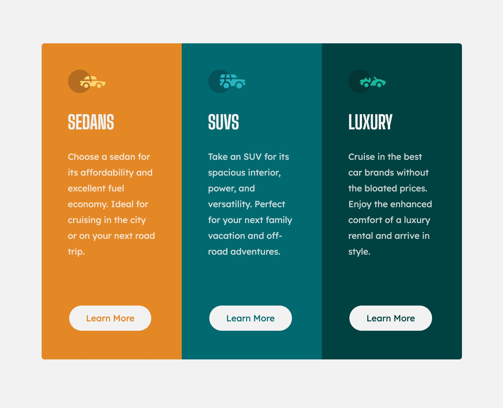

# Frontend Mentor - 3-column preview card component solution

This is a solution to the [3-column preview card component challenge on Frontend Mentor](https://www.frontendmentor.io/challenges/3column-preview-card-component-pH92eAR2-). Frontend Mentor challenges help you improve your coding skills by building realistic projects. 

## Table of contents

- [Overview](#overview)
  - [The challenge](#the-challenge)
  - [Screenshot](#screenshot)
  - [Links](#links)
- [My process](#my-process)
  - [Built with](#built-with)
  - [What I learned](#what-i-learned)
  - [Continued development](#continued-development)
  - [Useful resources](#useful-resources)
- [Author](#author)
- [Acknowledgments](#acknowledgments)

**Note: Delete this note and update the table of contents based on what sections you keep.**

## Overview

### The challenge

Users should be able to:

- View the optimal layout depending on their device's screen size
- See hover states for interactive elements

### Screenshot




### Links

- Solution URL: [Add solution URL here](https://your-solution-url.com)
- Live Site URL: [Add live site URL here](https://your-live-site-url.com)

## My process

### Built with

- Semantic HTML5 markup
- CSS custom properties
- CSS Grid
- Mobile-first workflow

### What I learned

I'm getting more comfortable with CSS grid, but I am still struggling with getting the CSS layout just right.

```css
  @media (min-width: 375px) {
    .container {
      grid-template-columns: 1fr 1fr 1fr;
    }
    .block-1 {
      border-radius: 10px 0px 0px 10px;
    }
    .block-3 {
      border-radius: 0px 10px 10px 0px;
    }
  }
```

### Continued development

I would like to get better at using flexbox, and use more responsive sizing for elements/text rather than just px.

### Useful resources


## Author

- Frontend Mentor - [@yourusername](https://www.frontendmentor.io/profile/yourusername)
- Github - [@yourusername](https://www.twitter.com/yourusername)

## Acknowledgments
